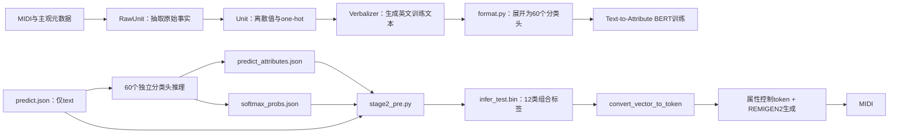

# MuseCoco 运行逻辑与自建编码设计

## 1. 目的与结论

本文记录对本地 MuseCoco 项目的运行链路、属性编码、训练时属性遮蔽和推理消费方式的源码审计结果，为第一阶段故事 Agent 后续实现确定性 MuseCoco 编码器提供依据。

核心结论如下：

1. `predict.json` 只是文本输入，格式为 `[{"text": "..."}]`，不包含属性编码。
2. Text-to-Attribute 模型包含 60 个彼此独立的分类头，输出 `predict_attributes.json` 和 `softmax_probs.json`。
3. `stage2_pre.py` 将 28 个乐器头和 22 个流派头重新组合，形成每条样本包含 12 类属性的 `infer_test.bin`。
4. Attribute-to-Music 推理实际读取 `pred_labels`，将 one-hot 转为属性 token；当前主推理路径不读取 `pred_probs`。
5. 当前音乐生成词典完整包含乐器与流派的 yes/no/NA 三态 token，hard-no 是模型训练机制的一部分。
6. 三份 `attribute_unit` 有 3 个文件不一致，尤其 `P4` 在文本数据准备中使用 `floor`，音乐生成模型中使用 `ceil`。生成侧兼容性必须以当前 Attribute-to-Music 代码和 checkpoint 为最终权威。
7. 自建编码器不应直接导入 WSL 中的 `Unit*` 类，而应把已审计的编码契约版本化复制到本项目，并在适配器边界进行严格校验。

本文与 [MuseCoco直接编码规则.md](./MuseCoco直接编码规则.md) 配套。后者记录本项目的封闭世界要求：DeepSeek 已知字段中，未选选项必须编码为 hard-no，而不是 NA。

## 2. 已审计的本地版本

本次读取的 MuseCoco 根目录：

```text
$HOME/muzic/musecoco
```

关键契约文件：

| 文件 | SHA-256 |
|---|---|
| `1-text2attribute_model/data/att_key.json` | `8BE36050B25A123DCF4109E090B00C6ABE3465638B9C2C9D971DA24B6A9006B2` |
| `1-text2attribute_model/num_labels.json` | `758A06181BD3CEC223F5D72A5686FFE91959C1F9BD5EE426BA0D936D2BFFC105` |
| `1-text2attribute_model/stage2_pre.py` | `681907A52EE266835D6F98B6A96428310C48320775232CD7D3D73B52F3152A80` |
| `1-text2attribute_model/predict.sh` | `98662D452DC6B88F9A7493B753BC272DF633516B02B8E238C118078E79B91B3D` |
| 三份 Attribute-to-Music `dict.txt` | `9EFBF5CFEB4B0E10D586034277AEC0BE3E4CEBDE755D6C28D82BEBD41A722445` |

当前 1-billion checkpoint：

```text
2-attribute2music_model/checkpoints/linear_mask-1billion/checkpoint_2_280000.pt
size = 14546294489 bytes
```

checkpoint 文件很大，本次未完成整文件 SHA-256；正式冻结部署环境时应离线计算并写入兼容清单。

Text-to-Attribute 生成的 `infer_test.bin` 与复制到 Attribute-to-Music 输入目录的文件哈希一致：

```text
044D23B9D030F133A61B044F2319C8D78FF9007D0D83464BE037D2C3BDA8A4DB
```

## 3. 完整运行链路



### 3.1 MIDI属性抽取层

`RawUnit*` 负责从 MIDI、路径或外部元数据抽取原始事实；`Unit*` 负责把原始事实离散化。

```text
RawUnitP1/P2 -> 最低音/最高音
UnitP4       -> 八度跨度类别

RawUnitR3    -> onset / beat
UnitR3       -> low / medium / high

RawUnitT1    -> 片段中出现的tempo集合
UnitT1s1     -> slow / moderate / fast
```

自建编码器的输入已经是 Stage 1 的规范化属性，不需要重新执行 RawUnit MIDI 抽取。

### 3.2 文本训练数据层

`1-text2attribute_dataprepare/verbalizer.py` 将属性替换进模板，并包含情绪、乐器等英文同义词。`format.py` 调用 `get_vector()`，再把 `I1s2` 和 `S4` 展开为独立分类头。

训练数据的 `use_info_dict` 可分别表达：

```text
used      明确使用
unused    明确不使用
unknown   未选择或NA
```

### 3.3 Text-to-Attribute 模型

`1-text2attribute_model/model.py` 为每个 `num_labels.json` 键建立一个独立线性分类头，并对每个头使用交叉熵损失。模型使用多个特殊 CLS token，每个分类头读取自己的 pooled 表示。

因此：

- 60 个头分别做 argmax；
- 跨字段不存在统一冲突解析器；
- `softmax_probs` 只是各分类头自己的 softmax 分布；
- one-hot 标签是 softmax argmax 的结果。

### 3.4 `stage2_pre.py`

输入：

```text
data/predict.json
tmp/predict_attributes.json
tmp/softmax_probs.json
data/att_key.json
```

处理：

- 按文本样本顺序组合结果；
- 将 28 个 `I1s2_*` 分类头组合为 `I1s2: [28][3]`；
- 将 22 个 `S4_*` 分类头组合为 `S4: [22][3]`；
- 其他 10 个分类头保持单一 one-hot；
- pickle 写出 `infer_test.bin`。

实际 `infer_test.bin` 顶层是样本列表。每条官方样本形状为：

```text
text
pred_labels
pred_probs
```

其中 `pred_labels` 与 `pred_probs` 均包含 12 个组合键：

```text
R1, R3, S2s1, B1s1, TS1s1, K1, T1s1, P4, EM1, TM1, I1s2, S4
```

### 3.5 Attribute-to-Music 推理

`interactive_dict_v5_1billion.py` 的主路径：

```python
pred_labels = test_command[i]["pred_labels"]
attribute_tokens = convert_vector_to_token(pred_labels)
```

当前主路径不读取 `pred_probs`。`pred_probs` 被保存在官方 pickle 中，但不是生成控制 token 的来源。

`convert_vector_to_token()` 需要上述 12 类属性，并自动为缺失的以下三个属性写入 NA：

```text
I4  -> I4_28
C1  -> C1_4
ST1 -> ST1_14
```

## 4. 60个分类头与向量维度

官方 `att_key.json` 共 60 个键：

```text
28 × I1s2乐器头
1  × R1
1  × R3
1  × S2s1
22 × S4流派头
1  × B1s1
1  × TS1s1
1  × K1
1  × T1s1
1  × P4
1  × EM1
1  × TM1
= 60
```

| 组合属性 | 分类头数量 | 每头/向量维度 | 顺序 |
|---|---:|---:|---|
| `I1s2` | 28 | 每头 3 | yes, no, NA |
| `R1` | 1 | 3 | danceable, not danceable, NA |
| `R3` | 1 | 4 | low, medium, high, NA |
| `S2s1` | 1 | 18 | 17 位艺术家, NA |
| `S4` | 22 | 每头 3 | yes, no, NA |
| `B1s1` | 1 | 5 | 1-4, 5-8, 9-12, 13-16, NA |
| `TS1s1` | 1 | 8 | 4/4, 2/4, 3/4, 1/4, 6/8, 3/8, other, NA |
| `K1` | 1 | 3 | major, minor, NA |
| `T1s1` | 1 | 4 | slow, moderate, fast, NA |
| `P4` | 1 | 13 | 0..11 octaves, NA |
| `EM1` | 1 | 5 | Q1, Q2, Q3, Q4, NA |
| `TM1` | 1 | 6 | 0-15, 15-30, 30-45, 45-60, 60+, NA |

## 5. 固定类别顺序

### 5.1 `I1s2` 乐器顺序

```text
0  piano
1  keyboard
2  percussion
3  organ
4  guitar
5  bass
6  violin
7  viola
8  cello
9  harp
10 strings
11 voice
12 trumpet
13 trombone
14 tuba
15 horn
16 brass
17 sax
18 oboe
19 bassoon
20 clarinet
21 piccolo
22 flute
23 pipe
24 synthesizer
25 ethnic_instruments
26 sound_effects
27 drum
```

展开键名为 `I1s2_<name>`。每个键使用：

```text
[1,0,0] yes
[0,1,0] no
[0,0,1] NA
```

### 5.2 `S2s1` 艺术家顺序

```text
0  beethoven
1  mozart
2  chopin
3  schubert
4  schumann
5  bach-js
6  haydn
7  brahms
8  Handel
9  tchaikovsky
10 mendelssohn
11 dvorak
12 liszt
13 stravinsky
14 mahler
15 prokofiev
16 shostakovich
17 NA
```

Stage 1 当前规范值需要适配：

```text
bach    -> bach-js
handel  -> Handel
```

### 5.3 `S4` 流派顺序

```text
0  new_age
1  electronic
2  rap
3  religious
4  international
5  easy_listening
6  avant_garde
7  rnb
8  latin
9  children
10 jazz
11 classical
12 comedy_spoken
13 pop_rock
14 reggae
15 stage
16 folk
17 blues
18 vocal
19 holiday
20 country
21 symphony
```

展开键名为 `S4_<name>`，每头同样使用 yes/no/NA 三态向量。

## 6. Stage 1规范值到官方向量

建议在本项目中独立实现纯函数编码，不直接依赖 MuseCoco Python package。

| Stage 1值 | 官方向量 |
|---|---|
| `R1=danceable` | `[1,0,0]` |
| `R1=not_danceable` | `[0,1,0]` |
| `R3=low` | `[1,0,0,0]` |
| `R3=medium` | `[0,1,0,0]` |
| `R3=high` | `[0,0,1,0]` |
| `B1s1=1-4/5-8/9-12/13-16` | 索引 `0/1/2/3`，NA索引4 |
| `TS1s1=4/4,2/4,3/4,1/4,6/8,3/8` | 索引 `0..5`，other索引6，NA索引7 |
| `K1=major/minor` | 索引 `0/1`，NA索引2 |
| `T1s1=slow/moderate/fast` | 索引 `0/1/2`，NA索引3 |
| `P4=n` | 索引 `n`，NA索引12 |
| `EM1=Q1/Q2/Q3/Q4` | 索引 `0/1/2/3`，NA索引4 |
| `TM1=0-15/15-30/30-45/45-60/60+` | 索引 `0/1/2/3/4`，NA索引5 |

所有普通分类向量必须严格 one-hot。`get_id()` 对多于一个 `1` 会报错；全零向量会返回 `None`，随后产生非法 token，因此本项目必须提前拒绝全零向量。

## 7. Hard-no与NA的训练证据

当前音乐生成训练脚本明确使用：

```text
--command_mask_prob -1
```

在 `A2M_task_new.py/get_input_command_token_v3()` 中，多标签属性按以下方式采样：

1. 从真实使用项中随机选一部分写 yes；
2. 从其余位置中随机选一部分写 no；
3. 剩余位置写 NA。

因此 Attribute-to-Music 模型确实见过并训练过：

```text
I1s2_<index>_0  yes
I1s2_<index>_1  no
I1s2_<index>_2  NA

S4_<index>_0    yes
S4_<index>_1    no
S4_<index>_2    NA
```

当前词典共 1249 个 token；预期的 268 个属性 token 全部存在，包括：

```text
28 个 I1s2 hard-no token
22 个 S4 hard-no token
```

这证明本项目的封闭世界编码在词典和训练机制上合法。但训练时 no 是从候选位置随机抽取的；把所有未选选项同时设为 no 可能比训练样本更强、更密集，仍需用实际生成做 A/B 验证。

## 8. 三套编码源码差异

比较位置：

```text
1-text2attribute_dataprepare/midi_data_extractor/attribute_unit
2-attribute2music_dataprepare/midi_data_extractor/attribute_unit
2-attribute2music_model/midi_data_extractor/attribute_unit
```

30 个文件中：

```text
27 个三处完全一致
3 个音乐生成模型版本不同：unit_em.py, unit_p.py, unit_s.py
```

### 8.1 `P4`差异

文本数据准备与音乐数据准备：

```python
floor((high - low) / 12)
```

音乐生成模型目录：

```python
ceil((high - low) / 12)
```

影响：目标 `P4=n` 的向量位置没有变化，但生成后从 MIDI 重新检测 `P4` 时可能相差 1。与当前生成 checkpoint 对齐的验证器应使用音乐生成模型目录的 `ceil` 语义，并把版本记录在审计产物中。

### 8.2 `EM1/S2s1/S4`差异

文本数据准备版本从嵌套字典中读取：

```text
emotion['emotion']
artist['artist']
genre['genre']
```

音乐生成模型版本直接读取字符串或集合。该差异影响原始数据抽取接口，不影响已经确定的最终类别顺序和向量位置。

### 8.3 已发现的源码缺陷

文本数据准备 `UnitR3.vector_dim` 写成 `raise 4`，但 `get_vector()` 内部硬编码长度4。自建编码器不得调用该错误属性，应以 `num_labels.json` 的4维契约为准。

## 9. 概率的处理原则

官方 Text-to-Attribute 流程生成两类结果：

```text
predict_attributes.json  argmax后的one-hot
softmax_probs.json       各分类头softmax分布
```

规则编码器只能产生确定性标签，不能产生真实模型概率。实测当前官方 `stage2_pre.py` 强制读取 `tmp/softmax_probs.json`，因此项目采用以下外部兼容契约：

- `softmax_probs.json` 必须是单样本 `predict_attributes.json` 的同形、同内容复制；
- 审计必须记录 `probability_source=deterministic_one_hot`、`uses_stage1_model=false`；
- 不得把该文件解释为 Stage1 模型的 softmax、置信度或概率估计；
- 仍由未修改的官方 `stage2_pre.py` 生成 `infer_test.bin`，并由未修改的官方 Stage2 推理脚本生成音乐；
- 每个任务输出必须留存输入、兼容副本、哈希和审计，从而能够区分确定性控制输入与模型概率。

完整任务包和队列契约见 [`MuseCoco任务包队列自动化.md`](MuseCoco任务包队列自动化.md)。

## 10. 推荐的自建编码边界

### 10.1 Stage 1内部规范对象

继续以 `musecoco_attribute_targets` 作为语义权威：

```json
{
  "I1s2": ["violin"],
  "R1": "not_danceable",
  "R3": "high",
  "S2s1": "beethoven",
  "S4": ["classical"],
  "B1s1": "1-4",
  "TS1s1": "4/4",
  "K1": "minor",
  "T1s1": "moderate",
  "P4": 2,
  "EM1": "Q2",
  "TM1": "0-15"
}
```

该对象不包含 one-hot，便于人读、Schema校验和规则演化。

### 10.2 纯编码器

新增纯函数模块，职责限制为：

```text
规范属性 -> 官方组合one-hot
组合one-hot -> 官方60头扁平格式
组合one-hot -> Attribute-to-Music token列表
```

不得在编码器中：

- 再次调用 DeepSeek；
- 猜测缺失语义；
- 修改故事结构；
- 生成伪概率；
- 从 WSL 运行时动态导入 MuseCoco源码。

### 10.3 推荐交付文件

MuseCoco 专用目录建议增加：

```text
predict.json                       官方文本模型输入，可选运行Text-to-Attribute
predict_index.json                 数组索引到theme_family_id的映射
direct_attribute_labels.json       本项目可审计的12类组合硬标签
predict_attributes.json            官方60头批量格式
encoding_manifest.json             版本、哈希、来源和closed-world策略
```

不要在 Stage 1 中直接把 pickle 作为唯一权威产物。推荐由独立 WSL 适配器读取上述 JSON，再写 `infer_test.bin`，原因是：

- pickle 不适合作为长期跨环境契约；
- JSON 可做 Schema 校验和哈希；
- theme family 索引可明确追踪；
- MuseCoco升级时只需替换适配器。

## 11. 官方扁平格式

`predict_attributes.json` 是“按分类头组织、样本为第二维”的对象：

```json
{
  "I1s2_piano": [[1, 0, 0], [0, 1, 0]],
  "I1s2_violin": [[0, 1, 0], [1, 0, 0]],
  "R3": [[1, 0, 0, 0], [0, 0, 1, 0]]
}
```

要求：

- 键集合与 `att_key.json` 精确一致；
- 键顺序按冻结的 `att_key.json` 输出；
- 每个键的样本数量一致；
- 样本顺序与 `predict.json`、`predict_index.json` 一致；
- 各向量维度与 `num_labels.json` 一致。

## 12. 封闭世界编码

当 DeepSeek 或 Python 已确定 `I1s2`/`S4` 字段时：

```text
选中项   -> [1,0,0]
其他项   -> [0,1,0]
不存在NA
```

字段整体未知时：

```text
全部项 -> [0,0,1]
```

空列表禁止进入编码器。未知必须显式使用 `null` 或未来 Schema 中的 `status=unknown`。

当前 Stage 1正式 `ThemeFamily` 要求所有12类属性均有效，因此正常模式不会产生未知字段；unknown能力应只存在于未来通用编码接口中，不应削弱现有正式计划的完整性要求。

## 13. 编码manifest

每次导出建议记录：

```json
{
  "schema_version": "musecoco-direct-encoding-v1",
  "encoding_source": "deterministic_agent",
  "closed_world_multilabel": true,
  "att_key_sha256": "8BE36050B25A123DCF4109E090B00C6ABE3465638B9C2C9D971DA24B6A9006B2",
  "num_labels_sha256": "758A06181BD3CEC223F5D72A5686FFE91959C1F9BD5EE426BA0D936D2BFFC105",
  "attribute_dictionary_sha256": "9EFBF5CFEB4B0E10D586034277AEC0BE3E4CEBDE755D6C28D82BEBD41A722445",
  "p4_verification_semantics": "ceil-semitone-span-over-12",
  "probabilities": "not_produced"
}
```

## 14. 必须实现的校验

1. 规范属性键集合精确等于12类。
2. 所有枚举值必须在冻结码本内。
3. 已知 `I1s2/S4` 非空，选中与未选全集无重叠、无遗漏。
4. 28个乐器头和22个流派头均严格为三态one-hot。
5. 其他10个向量严格one-hot，且维度匹配。
6. closed-world已知字段中不得存在NA。
7. unknown字段中不得存在yes或no。
8. 60头扁平键集合、顺序和样本数精确匹配官方契约。
9. 生成的268个属性token全部存在于冻结词典。
10. 三个自动补齐token固定为 `I4_28/C1_4/ST1_14`。
11. 艺术家别名只允许显式转换，不允许大小写模糊匹配后静默接受。
12. 编码失败时不得留下部分发布目录。

## 15. 测试设计

### 15.1 单元测试

- 12类属性每个边界值的one-hot位置；
- 28个乐器和22个流派的yes/no/NA；
- `bach/handel`别名；
- 空列表、未知值、全零、多1向量拒绝；
- 60头展开与12类重组双向一致；
- `att_key/num_labels/dict`哈希漂移拒绝。

### 15.2 契约测试

- 读取当前官方 `att_key.json` 和 `num_labels.json` 比较快照；
- 将自建 `predict_attributes.json` 送入兼容版 `stage2_pre`；
- 验证生成 pickle 可被 `interactive_dict_v5_1billion.py` 读取；
- 验证 token 数量、顺序和词典存在性。

### 15.3 生成烟雾测试

至少准备：

```text
solo piano + classical + slow + low R3
solo violin + classical + moderate + high R3
piano/cello双乐器 + 两个genre
全部未选乐器/流派hard-no
```

比较三组输入：

```text
A 官方Text-to-Attribute预测标签
B 自建标签，未选项NA
C 自建标签，未选项全部hard-no
```

检查生成成功率、目标乐器命中率、是否出现被禁止乐器，以及音乐质量变化。C组是本项目最终规则，但必须量化其相对训练分布的影响。

## 16. 实现顺序建议

1. 冻结码本常量和契约哈希。
2. 实现12类组合编码器及严格校验。
3. 实现60头扁平导出与索引文件。
4. 增加MuseCoco目录内独立交付文件，不修改heartbeat和stage2职责。
5. 编写JSON到`infer_test.bin`的WSL适配器。
6. 先做不含概率的实际生成烟雾测试。
7. 对NA与全hard-no做A/B测试。
8. 验证后再决定是否默认绕过Text-to-Attribute模型。

## 17. 当前实现状态

2026-07-20 已完成步骤 1–4：

- `stage1_story_agent/musecoco_encoder.py` 冻结码本、契约哈希和官方键序；
- 12类属性可确定性编码为组合one-hot、官方60分类头和每主题63个控制Token；
- `I1s2/S4` 已执行封闭世界hard-no规则；
- 每次成功运行在独立 `*-musecoco` 目录发布五个直接编码文件及原始 `musecoco_plan.json`；
- 已覆盖编码单元测试、键序/维度契约测试、文件哈希测试和原子发布集成测试。

尚未完成步骤 5–8：当前不会创建 Python pickle `infer_test.bin`，也尚未在 Attribute-to-Music checkpoint 上进行实际生成烟雾测试和 NA/hard-no 音乐质量 A/B 测试。
