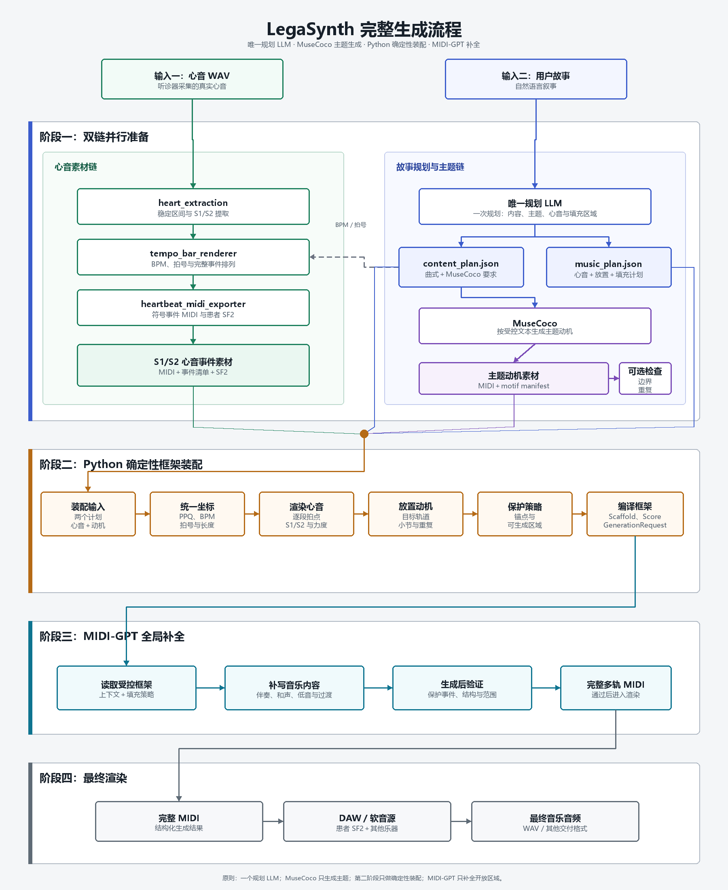

# LegaSynth 完整流程、系统边界与 Agent 同步记录

## 2026-07-22 Stage 2 任意曲式正式化

- Stage 1→Stage 2 的每个 section 现显式交付 `form_label`、`theme_family_id`、`relation`、`source_section_id` 和 `material_source`，不再依靠 A/B 位置推断素材关系。
- Stage 2 正式入口改为计划驱动的动态装配：支持 1–16 个连续 section、任意合规曲式、任意数量主题家族、不同主题 PPQ 和逐段速度。
- `fixed` 直接放置受保护素材；`extension_only` 使用本段主题作为续写上下文；`modifiable` 使用计划指定的较早来源段生成变奏/发展。MIDI-GPT 仅写回 editable 范围。
- 装配前移除所有输入主题的通道 10，按 Stage 1 计划重建心跳轨；补全后恢复逐段速度图并再次校验心跳事件。
- 新增 `stage2_plan.resolved.json` 作为经严格校验的冻结计划；`stage3_handoff.json` 状态为 `production`，并显式包含 `form_string` 和 `total_bars`。主控和 Stage 3 不再假定 48 小节。
- 离线回归覆盖 `A-B-A'-C`、变奏来源、动态编辑区间、PPQ 换算和通道 10 清理；MuseCoco 官方代码与 WSL wrapper 未修改。

## 2026-07-22 Stage 2 可选整体重复检测与局部再生成

- 位置：MIDI-GPT 完成整曲之后、`stage3_handoff.json` 发布之前。
- 用户接口：`off`（默认）、`detect`（只报告）、`regenerate`（局部再生成）。
- 检测方法：以连续两个小节为窗口，合并所有非打击乐轨的同期音高织体；不分类旋律/和声，节奏不作为独立评分，排除 MIDI 通道 10。
- 默认规则：相似度阈值 `0.82`，允许两次不变复现，从第三次高度相似出现开始标记。
- 再生成边界：只修改 Stage 1 计划声明的 editable 小节；主题保护区、最终两小节终止式和完整心跳事件不变。每个目标默认生成四个 MIDI-GPT 候选并选择通过阈值者。
- 审计：Stage 2 输出 `stage2_repetition_report.json`；再生成前保留 `final_completed.pre_repetition_gate.mid`，完成清单记录模式、阈值、问题数和报告哈希。

## 2026-07-22 Stage 3 感知型心跳动态平衡

Stage 3 新增 `perceptual_event_adaptive`：使用 BS.1770 K-weighting 逐事件测量真实心跳与同期音乐，分别计算 S1/S2 增益并限制相邻变化；心跳增益具有下限，避免旧 RMS 模式在低频能量较高时反向衰减心跳。增益不足时只在事件附近对音乐执行有上限的 attack/hold/release 闪避，随后按目标 LUFS 和真峰值共同母带化。MIDI 时间、心音音高和播放速度均不改变，逐事件决策写入 CSV 和渲染清单。

## 2026-07-22 Stage 1 双调性策略

Stage 1 后处理新增 `tonality_policy=loose|strict`，并贯通 `plan`、`enqueue-musecoco` 与一键主控。`loose` 完全跳过调性检测和音高改写，按字节复制速度归一化 MIDI 为 `final.mid`；`strict` 检测实际主音/调式，强制移到计划主音，大小调不一致时按自然大调/自然小调规则调整第 3、6、7 级。两种策略均写入主题归一化审计和最终主题清单。默认是 `strict`。

## 2026-07-22 MuseCoco WSL 入口去 PATH 依赖

Windows→WSL 队列桥接器新增成对配置 `MUSECOCO_QUEUE_PYTHON` 与 `MUSECOCO_QUEUE_SCRIPT`，可以直接执行已部署的 Python wrapper，不再要求 `legasynth-musecoco` 已进入 WSL 登录 shell 的 `PATH`。原 `MUSECOCO_QUEUE_COMMAND` 接口继续兼容；显式解释器/脚本配置优先。该变化仅位于项目桥接层，未修改 WSL wrapper 或任何 MuseCoco 官方文件。

## 2026-07-22 Windows MIDI-GPT 0.3.2 接入

Stage 2 的真实推理环境已固定为 Windows 原生独立解释器，模型通过 PyPI `midigpt 0.3.2` 的 Python API 加载，不使用 WSL、HTTP 服务或源码仓库。主控从仓库根目录 `.env`、进程环境或 CLI 读取 `LEGASYNTH_MIDIGPT_PYTHON` 和 `LEGASYNTH_MIDIGPT_MODEL`，并把模型名明确传给 `stage2/run_pipeline_relative.py`。`HF_HOME` 由子进程继承，用于固定 Hugging Face 缓存根目录。Stage 2 内部仍以 `sys.executable` 启动补全脚本，因此整个 Stage 2 始终运行在同一个 MIDI-GPT 环境中。当前模型为 `yellow`；没有把本机绝对路径、权重 snapshot 或缓存哈希写入可分享代码。

## 2026-07-21 本地全流程主控

新增 `legasynth_orchestrator/`，在无前端条件下提供本机单任务一键调用。主控复制输入到隔离 job 目录，依次运行心音 Stage 1、Story Agent/WSL MuseCoco、Stage 2/MIDI-GPT 和 Stage 3，记录逐阶段日志、状态、失败信息和 SHA-256。`--dry-run` 及假执行器测试覆盖完整业务编排但不会启动任何真实模型。主控只调度冻结接口，不接管各阶段业务权威。

## 2026-07-21 Stage 2 测试状态与自动交接（历史记录）

该版本当时固定三段 `A-B-A`，每段接收 8 小节 Stage 1 主题并生成后续 8 小节，总计 48 小节。该限制已被 2026-07-22 的任意曲式正式入口取代；仅保留本节作为历史审计。

## 2026-07-21 Stage 1 / Stage 3 长度合同更新

Stage 1 测试模式现为 48 小节 `A-B-A`，三段均由 8 小节主题和 8 小节填充组成；正式模式不固定曲式标签和段落数量，但默认每段同样采用 8+8。正式 Stage 3 保持长度无关，不重新规划或移动心跳事件，并新增 48 小节完整 MIDI 回归覆盖。Stage 2 本次未修改。

## 2026-07-21 Stage 2 入口适配

保留 `stage2/run_pipeline_relative.py` 为正式入口，新增 `--stage2-plan`。
入口严格核对 Stage 1 交付与 A/B/A 算法，按逐段指令生成 S1/S2 心跳轨，
并在 MIDI-GPT 后验证心跳事件未改变；`final_completed.mid` 与
`stage2_completion_manifest.json` 一并交付 Stage 3。

> 文档用途：供项目负责人、开发者和其他 Agent 回顾整体目标、核对当前进度、理解数据契约并继续开发。  
> 最后更新：2026-07-20  
> 当前阶段（2026-07-20）：三阶段职责以 [`三阶段职责边界.md`](三阶段职责边界.md) 为权威。Stage 1 负责规划、心音素材、MuseCoco主题生成以及主题MIDI速度/调性/小节长度修正；Stage 2 负责心跳鼓轨、完整MIDI框架和MIDI-GPT补全；Stage 3 只对已经包含心跳鼓轨的完整MIDI统一渲染混音。  
>
> 最新架构决定：MuseCoco生成与主题MIDI修正在Stage 1；第二阶段根据鼓轨指令生成并保护完整心跳鼓轨；第三阶段不重新生成心跳轨，只统一渲染完整MIDI。一次 Agent 运行仍创建四个独立同前缀目录。本文后续相反描述属于历史记录。
> 维护规则：任何 Agent 修改跨模块接口、实现状态或关键决策后，都必须同步更新本文档。

## 1. 项目目标

项目接收两个具有不同性质的原始输入：

1. 听诊器采集的真实心音片段；
2. 用户用自然语言描述的“故事”。

两条输入链并行处理：

- 心音经过确定性信号处理，转换为保留患者 S1/S2 特征、可被重新编排的心音事件素材；
- 故事只经过一个规划 LLM。它一次性规划 A/B/A′/C 等曲式、全曲总体调性、精确段落小节数、MuseCoco 主题请求，以及包含心音节奏、动机放置和 MIDI-GPT 填充区域的完整框架；
- A/B/C 等新主题家族各准备一条 MuseCoco 受控英文 `text`，A′/A″等变奏交给后续 MIDI-GPT；心音方案同时按段落明确密度、拍点、S1/S2 排列和力度。

MuseCoco 随后按计划生成主题动机。第二阶段没有 LLM：Python 框架装配器把实际动机和心音事件绑定到第一阶段已经冻结的计划，按段落重新排列心音事件、放置多个主题动机，并搭建 MIDI-GPT 可处理的多轨框架。若实际素材不符合计划，程序应拒绝、重试 MuseCoco 或交由人工处理，而不是新增一次 LLM 重新规划。MIDI-GPT 最后根据完整上下文补写伴奏、和声、低音、过渡、配器和其他空白小节。

## 2. 一句话架构

> 一个规划 LLM 根据故事一次性输出主题请求和全曲框架；MuseCoco 生成主题，Python 把主题与真实 S1/S2 素材确定性地编译为 MIDI-GPT 上下文，MIDI-GPT 只补全明确允许生成的区域。

## 3. 完整流程图



> 本图采用固定坐标渲染，不受 Markdown Mermaid 版本影响。可编辑绘图源：[`assets/render_pipeline_diagram.py`](assets/render_pipeline_diagram.py)。

## 4. 不可混淆的职责边界

### 4.1 LLM

全流程只有一个规划 LLM。它不直接生成 MIDI 音符，也不在 MuseCoco 之后再次调用：

- 把故事叙事段落映射为 A/B/A′/C 等曲式，规划全曲总体调性和每段精确小节数，区分新主题家族与已有主题变奏；
- 为新主题家族输出项目自定义的 MuseCoco 属性目标与受控英文文本；
- 在同一规划结果中输出逐段轨道、基于稳定 `motif_id`/主题家族 ID 的动机放置、心音节奏和 MIDI-GPT 填充计划；
- 曲式段落数量和每段小节数由该 LLM 根据故事决定；用户约束可给出总量或上限，但 Python 不平均分配、不套固定曲式；
- 心音规划必须随叙事情绪变化，而不是默认把同一小节机械循环到全曲；
- 每段心音方案必须明确小节范围、事件单位、拍点或间距、S1/S2 顺序、力度和未覆盖小节策略。

LLM 输出必须通过 Schema 校验。任何无法验证的自然语言都不能直接进入后续程序。

### 4.2 MuseCoco

MuseCoco 的职责是根据控制指令生成若干主题动机，不负责完成整首作品，也不负责放置心音轨。每段输出必须具有唯一 `motif_id`，并能追溯到产生它的控制请求。

### 4.3 Python 框架装配器

框架装配器是系统的结构权威，负责：

- 统一 PPQ、BPM、拍号、调性和小节长度；
- 严格执行 LLM 给出的段落 `bar_count`，只计算连续起止坐标并检测总量、缺口和重叠，不重新决定段落长度；
- 根据 `heartbeat_arrangement` 选择、复制和移动完整 S1/S2 事件，渲染逐段心音轨；
- 不对“和缓”“激情”“打一拍”“半拍”等自然语言自行猜测，只执行已经量化的拍点、间距和力度字段；
- 把多个动机放入指定轨道和小节；
- 设定 General MIDI program 和鼓轨规则；
- 标记哪些音符、小节和轨道必须保持不变；
- 标记 MIDI-GPT 可以补写的区域；
- 构造 `Score` 与 `GenerationRequest`，而不只是拼接一个普通 MIDI 文件；
- 生成可审计的装配清单。

### 4.4 MIDI-GPT

MIDI-GPT 不是 BPM 检测器、动机检测器或故事理解器。它负责在既有上下文中补全指定区域。正常情况下：

- 心音轨是受保护锚点；
- 已批准的主题动机是受保护内容或强条件提示；
- 伴奏、和声、低音、过渡和其他空白小节是生成区域；
- 生成后必须验证受保护内容没有被改写。

### 4.5 MIDI 动机检测器

`midi_motif_detector` 是可选质量检查工具。它可以检查 MuseCoco 输出的动机边界、重复和移调关系，但不承担主题生成职责。

## 5. 当前实现状态

| 组件 | 位置 | 版本/状态 | 当前输入 | 当前输出 |
|---|---|---|---|---|
| 心音提取 | `heart_extraction/` | `1.3.0`，已实现 | 原始心音 WAV | 9 个处理 WAV、分析报告、能量图 |
| 节拍小节渲染 | `tempo_bar_renderer/` | `1.6.0`，已实现 | 9 个 WAV 中选定的一个 | 4/4、3/4、2/4 WAV、事件 CSV、分析 JSON |
| 心音第一部分总入口 | `heartbeat_stage1/` | `1.0.0`，已实现 | 原始 WAV、用户/LLM资产级 `rhythm_plan.json` | `regularized_events_enhanced` 完整审计组、便携 `heartbeat_package`、WAV/MIDI/事件/能量图 |
| 后置心跳重生成实验 | `heartbeat_post_renderer/` | 不属于正式流程，停止接入 | — | 不得作为 Stage 3 入口 |
| 心音 MIDI 导出 | `heartbeat_midi_exporter/` | `1.1.0`，已实现 | `*_bar_analysis.json` 和同组 CSV | 可选拍号与 S1/S2 模式 MIDI、SF2、S1/S2 样本、映射 JSON |
| WAV 混音 | `wav_track_mixer/` | 已实现 | 两个 WAV | 自动循环较短轨的混合 WAV |
| MIDI 动机检测 | `midi_motif_detector/` | `1.0.0`，已实现 | 通用旋律 MIDI | 动机起止、重复位置、置信度 JSON |
| MIDI-GPT 调研 | `docs/MIDI-GPT调研.md` | 已完成调研 | 官方论文和实现资料 | 接入建议与风险说明 |
| MuseCoco/MIDI-GPT 输入契约调研 | `docs/MuseCoco与MIDI-GPT输入要求.md` | 已完成字段级核对 | 官方代码、模型卡和推理入口 | 精确输入格式、属性枚举、版本陷阱与项目映射 |
| 单一故事/框架 LLM 规划器 | `stage1_story_agent/` | 分消费者计划、MuseCoco直接编码、确定性EM1、逐段鼓轨计划及MIDI强制速度/主音修正已实现 | 故事文本与规划约束 | MuseCoco、heartbeat、Stage 2、audit 四类分离产物 |
| MuseCoco 适配器 | 尚无模块 | 未实现 | 官方控制指令 | 多个主题动机 MIDI 和清单 |
| MIDI-GPT 框架装配器 | `midigpt_scaffold_builder/` | 已实现 `0.1.1`，8 项回归通过 | 音乐计划、动机、心音事件素材 | 已编排心音轨、`Score`、`GenerationRequest`、HTTP 请求体、装配清单 |
| MIDI-GPT 推理适配器 | 尚无模块 | 未实现 | 框架与 checkpoint | 完整多轨 MIDI、推理清单 |
| 最终 MIDI 渲染 | `stage3_midi_renderer/` | 已实现；支持多 heartbeat package、独立响度平衡及任意合规曲长 | 完整 MIDI、通用 SF2、heartbeat package/心跳 SF2、渲染 plan | 最终 WAV、事件分配与混音审计清单 |

## 6. 当前已实现的心音链

### 6.0 推荐的心音第一部分总入口

```powershell
D:\conda\python.exe .\heartbeat_stage1\heartbeat_stage1.py `
  "D:\path\heartbeat.wav" `
  ".\heartbeat_stage1\examples\even_halfbeat_4_4_103p15.json"
```

该入口复用下述 6.1 与 6.2 的既有算法，但把原始 WAV、`regularized_events_enhanced` 和用户/LLM 指定的一小节 S1/S2 排列封装成同一个 `heartbeat_package`。资产级 `rhythm_plan.json` 负责定义一种可复用心跳 token；它不取代第一阶段故事 Agent 针对全曲分段输出的鼓轨规划。该规划应在 Stage 2 编译为整曲心跳鼓轨并写入完整 MIDI；Stage 3 不再读取它重新生成心跳事件。

### 6.1 原始心音到处理 WAV

```powershell
python .\heart_extraction\heart_sound_processor.py `
  "D:\path\heartbeat.wav" `
  --output-dir ".\processor_validation"
```

该步骤检测稳定区间和 S1/S2，输出 Stable、Authentic、Regularized 的 Base、Clean、Enhanced，共 9 个 WAV。

### 6.2 处理 WAV 到节拍小节

```powershell
python .\tempo_bar_renderer\tempo_bar_renderer.py `
  ".\processor_validation\sample\sample_regularized_events_clean.wav" `
  --target-bpm 100.3 `
  --beat-peak both `
  --pair-rhythm even
```

本步骤移动完整心音事件，不拉伸 S1/S2 波形。它同时输出机器可读的事件 CSV 和分析 JSON。

### 6.3 节拍小节到心音 MIDI

```powershell
D:\conda\python.exe .\heartbeat_midi_exporter\heartbeat_midi_exporter.py `
  ".\tempo_bar_renderer\outputs\group\xxx_bar_analysis.json"
```

心音 MIDI 默认位于 MIDI 通道 10，并以音符映射表示 S1/S2。患者真实音色保存在配套 SF2 中；MIDI-GPT 只处理符号事件，不包含 SF2 波形。这里产生的是供 Python 装配的**事件素材和事件清单**，不是最终全曲心音轨；最终轨道必须由第一阶段唯一 LLM 已经给出的分段方案驱动装配。

## 7. 单 LLM 规划产物与项目级概念草案

同一个第一阶段 Agent、同一次规划运行可以发布两个严格视图，以兼容现有消费者：`content_plan.json` 保存故事分析、全局调性、曲式、主题家族和 MuseCoco/变奏任务；`music_plan.json` 保存轨道、动机放置、`heartbeat_arrangement` 和 MIDI-GPT 填充区域。它们不是两个 LLM 阶段，必须共享 `story_id`、段落/主题引用、prompt 版本和运行 ID，并在同一原子产物目录中发布。BPM、拍号、总小节等全局值只由 `content_plan.json` 持有权威，`music_plan.json` 不重复这些字段，由装配器跨文件校验其小节坐标是否一致。

当前代码只实现了 `content_plan.json`；`music_plan.json` 的严格 Schema 已由 `midigpt_scaffold_builder` 实现，但第一阶段 Agent 尚未生成它。这是当前需要补齐的迁移缺口。第一阶段 LLM 不读取实际 MuseCoco MIDI 或心音事件；它按稳定 ID 和事件类型规划，Python 在素材产生后负责绑定并拒绝不符合计划的输入。

每个新主题家族含完整 12 类 MuseCoco 属性和程序生成的受控英文 `text`；A′/A″等段落引用已有家族并形成 MIDI-GPT 下游任务，不再次生成 MuseCoco 主题。在适配器 Schema 冻结前，`musecoco_requests` 必须为空。以下对象只用于同时表达两个输出视图的全局概念，**不能替代各模块的可执行 Schema**；实际字段分别以 [`第一阶段故事Agent详细设计.md`](第一阶段故事Agent详细设计.md) 和 `midigpt_scaffold_builder/models.py` 为准。

```json
{
  "schema_version": "0.2-draft",
  "story_id": "story-001",
  "global": {
    "tempo_bpm": 100.3,
    "time_signature": "4/4",
    "total_bars": 32,
    "global_tonality": {"tonic": "C", "mode": "minor"}
  },
  "story_analysis": {
    "summary": "结构化故事摘要",
    "emotional_arc": [],
    "narrative_segments": []
  },
  "form_plan": {
    "form_string": "A-B-A'-C",
    "sections": [
      {"section_id": "S1", "form_label": "A", "theme_family_id": "theme-A", "bar_start": 1, "bar_end": 8, "bar_count": 8},
      {"section_id": "S2", "form_label": "B", "theme_family_id": "theme-B", "bar_start": 9, "bar_end": 16, "bar_count": 8},
      {"section_id": "S3", "form_label": "A'", "theme_family_id": "theme-A", "bar_start": 17, "bar_end": 24, "bar_count": 8},
      {"section_id": "S4", "form_label": "C", "theme_family_id": "theme-C", "bar_start": 25, "bar_end": 32, "bar_count": 8}
    ]
  },
  "theme_families": [
    {
      "theme_family_id": "theme-A",
      "base_symbol": "A",
      "role": "main_theme",
      "seed_bars": 4,
      "musecoco_attribute_targets": {
        "I1s2": ["piano"],
        "R1": "not_danceable",
        "R3": "low",
        "S2s1": "chopin",
        "S4": ["classical"],
        "B1s1": "1-4",
        "TS1s1": "4/4",
        "K1": "minor",
        "T1s1": "moderate",
        "P4": 2,
        "EM1": "Q3",
        "TM1": "0-15"
      },
      "musecoco_text": "由 Python 固定模板生成的完整英文文本"
    }
  ],
  "variation_tasks": [
    {"task_id": "variation-S3", "target_section_id": "S3", "source_section_id": "S1", "theme_family_id": "theme-A", "strategy": "midigpt_variation", "target_bars": 8}
  ],
  "musecoco_requests": [],
  "arrangement": {
    "sections": [
      {"section_id": "S1", "form_label": "A", "bar_start": 1, "bar_end": 8, "character": "calm"},
      {"section_id": "S2", "form_label": "B", "bar_start": 9, "bar_end": 16, "character": "moving"},
      {"section_id": "S3", "form_label": "A'", "bar_start": 17, "bar_end": 24, "character": "building"},
      {"section_id": "S4", "form_label": "C", "bar_start": 25, "bar_end": 32, "character": "intense"}
    ],
    "tracks": [],
    "motif_placements": [],
    "heartbeat_arrangement": {
      "role": "protected_rhythm_anchor",
      "source_event_manifest": "heartbeat_event_manifest.json",
      "preserve_complete_events": true,
      "sections": [
        {
          "section_id": "S1",
          "bar_start": 1,
          "bar_end": 8,
          "intent": "和缓，每小节只出现一次完整心跳",
          "pattern": {
            "mode": "hits_per_bar",
            "hit_unit": "s1_s2_pair",
            "hits_per_bar": 1,
            "beat_positions": [1.0],
            "velocity_scale": 0.65
          }
        },
        {
          "section_id": "S2",
          "bar_start": 9,
          "bar_end": 16,
          "intent": "推进，心跳保持稳定但提高出现频率",
          "pattern": {
            "mode": "hits_per_bar",
            "hit_unit": "s1_s2_pair",
            "hits_per_bar": 2,
            "beat_positions": [1.0, 3.0],
            "velocity_scale": 0.8
          }
        },
        {
          "section_id": "S3",
          "bar_start": 17,
          "bar_end": 24,
          "intent": "逐渐积累张力，S1/S2 以一拍间距交替",
          "pattern": {
            "mode": "event_sequence",
            "event_sequence": ["S1", "S2"],
            "event_spacing_beats": 1.0,
            "start_beat": 1.0,
            "fill_to_bar_end": true,
            "velocity_scale": 0.9
          }
        },
        {
          "section_id": "S4",
          "bar_start": 25,
          "bar_end": 32,
          "intent": "激情，处理后的 S1/S2 以半拍等间距推进",
          "pattern": {
            "mode": "event_sequence",
            "event_sequence": ["S1", "S2"],
            "event_spacing_beats": 0.5,
            "start_beat": 1.0,
            "fill_to_bar_end": true,
            "velocity_scale": 1.0
          }
        }
      ],
      "unplanned_bars_policy": "error"
    }
  },
  "midigpt": {
    "checkpoint": "yellow",
    "model_dim_bars": 4,
    "protected_regions": [],
    "fill_regions": [],
    "generation_config": {
      "temperature": 1.0,
      "top_p": 0.95,
      "mask_mode": "attention"
    }
  }
}
```

### 7.1 心音编排字段的精确定义

上面的 A/C 段是当前意图的**可配置示例**，不是所有作品都必须使用的固定模板。为避免实现歧义，暂按以下方式解释：

- A 段“每小节心音只打一拍”：每小节在第 1 拍触发一次 `s1_s2_pair`，即一个完整心跳对，而不是只触发单独 S1；
- C 段“等间距的半拍”：S1、S2 作为独立事件交替出现，相邻事件起点相差 `0.5` 拍，并持续填充到小节末尾；
- `beat_positions` 和 `start_beat` 使用从 `1.0` 开始的小节内拍号坐标；
- `velocity_scale` 只调整 MIDI 力度或渲染增益，不改变原始 S1/S2 事件内部波形；
- Python 可以移动或复制完整事件，但不得通过时间拉伸把 S1/S2 本体压缩成半拍；“半拍”描述的是事件起点间距；
- 每个小节必须恰好命中一个心音规则；缺少规则时按 `unplanned_bars_policy: error` 拒绝装配，不能偷偷回退为循环。

如果项目负责人所说的“一拍”实际指单个 S1，或“半拍”实际指一个完整 S1/S2 对占半拍，只需修改 `hit_unit` 或明确增加 `pair_duration_beats`，不应修改装配器代码中的隐含假设。

## 8. MuseCoco 输出契约

MuseCoco 适配器不应只留下若干无法追溯的 `.mid` 文件。建议输出：

```text
musecoco_outputs/<story_id>/
  motif_01.mid
  motif_02.mid
  motif_03.mid
  motif_manifest.json
```

MuseCoco 原始 MIDI 通过解析校验后，必须依次调用 `stage1_story_agent normalize-tempo` 和 `stage1_story_agent normalize-key`。前者将全部 `Set Tempo` 事件统一到 `content_plan.json` 的权威 BPM；后者自动检测源调并把全部非鼓音符强制移到 `global.global_tonality` 的主音，同时保护通道 10 打击乐并更新调号。major/minor 不一致、检测含糊或音域越界时必须拒绝进入第二阶段。原始文件和归一化文件的 SHA-256 均写入命令审计输出。

`motif_manifest.json` 至少记录：

- `motif_id`；
- `request_id`；
- MIDI 路径和 SHA-256；
- MuseCoco 版本与 checkpoint；
- 原始控制字段；
- 随机种子；
- BPM、拍号、PPQ、小节数、轨道数；
- 是否通过 MIDI 解析和动机边界验证；
- 失败或重试原因。

## 9. Python 框架装配器的输出契约

建议新模块命名为：

```text
midigpt_scaffold_builder/
```

建议每次装配产生独立目录：

```text
midigpt_scaffold_builder/outputs/<story_id>_<timestamp>/
  heartbeat_arranged.mid
  scaffold.mid
  score.json
  generation_request.json
  heartbeat_render_manifest.json
  assembly_manifest.json
  validation_report.json
```

其中：

- `heartbeat_arranged.mid`：第一阶段唯一 LLM 的心音方案经 Python 确定性渲染后的完整心音轨；
- `scaffold.mid`：包含已编排心音、已放置动机和待填充区域，便于人工在 DAW/MuseScore 中查看；
- `score.json`：与 `midigpt.Score` 对应的可审计表示；
- `generation_request.json`：记录每条轨道的填充、忽略、保护和控制策略；
- `heartbeat_render_manifest.json`：逐事件记录来源 S1/S2、源文件哈希、目标小节/拍点/tick、力度缩放和采用的段落规则；
- `assembly_manifest.json`：记录所有输入哈希、版本、坐标转换和动机放置；
- `validation_report.json`：记录 PPQ、拍号、范围、空白区域和受保护事件检查。

框架装配器的最低验证要求：

1. 所有输入 MIDI 可解析；
2. 所有素材转换到同一 PPQ；
3. BPM、拍号、总小节数唯一且明确；
4. 动机不越过目标段落边界；
5. `heartbeat_arrangement` 的段落范围完整、无重叠，且每个目标小节恰好命中一个规则；
6. 每个心音事件的目标拍点、tick 和力度与规划一致，且能追溯到原始 S1/S2 素材；
7. 心音轨覆盖计划要求的全部小节，不存在装配器自行添加的隐式循环；
8. 受保护区域与填充区域不重叠；
9. `model_dim_bars` 为 checkpoint 支持的值；
10. 所有轨道都有稳定 ID、类型和 MIDI program；
11. 输入文件不被原地修改；
12. 所有输出包含版本、随机种子和 SHA-256。

## 10. MIDI-GPT 推理后的验证

不能把模型返回的 MIDI 直接视为最终结果。至少检查：

- 心音事件的 tick、音高、力度和时长是否保持；
- 受保护动机是否保持，或只发生计划允许的变化；
- 生成区域是否仍为空或全静音；
- 拍号、BPM、PPQ 和总小节数是否变化；
- 是否出现超出 MIDI 范围的 program、pitch、velocity；
- 是否违反硬复音上限；
- 是否出现异常长音、重叠 note-off 或悬挂音符；
- 是否存在过度复制输入动机；
- 生成参数、checkpoint 和耗时是否写入清单。

验证失败应触发拒绝或重新采样，不能静默修复后丢失审计信息。

## 11. 系统不变量

以下原则除非项目负责人明确修改，否则所有 Agent 都应遵守：

1. 原始心音 WAV 和所有上游输入只读，不原地覆盖。
2. 心音 S1/S2 主体不通过时间拉伸改变；只允许选择、移动或复制完整事件。
3. 患者 SF2 音色和心音 MIDI 符号事件分别保存，不把两者混为一体。
4. 全流程只有一个规划 LLM；它只输出结构化计划，不直接写任意 Python、MIDI 音符或未经验证的控制字段，并且必须显式规划心音轨。
5. MuseCoco 只负责生成主题动机，不承担全曲装配。
6. LLM 决定音乐意图和分段编排，Python 框架装配器是 PPQ、BPM、拍号、小节坐标、事件渲染和保护策略的执行权威。
7. MIDI-GPT 只能修改明确标记为可生成的区域。
8. 受保护的心音轨和动机在生成前后必须逐事件校验。
9. 所有生成步骤必须记录模型、版本、参数、随机种子和输入输出哈希。
10. 代码许可证、模型权重许可证和训练数据条款分别核对。

## 12. 尚未冻结的关键决策

这些问题会直接影响接口，不能由单个 Agent 静默决定：

| 问题 | 当前状态 | 需要的决定 |
|---|---|---|
| 全局 BPM 权威 | 第一阶段建议已冻结、全链权威未冻结 | 第一阶段在用户范围内建议 BPM；与自然心率冲突时由谁调整仍待决定 |
| 拍号权威 | 第一阶段建议已冻结、全链权威未冻结 | 唯一规划 LLM 从用户允许的 MuseCoco 非 NA 集合选择；Python 不改动，仍需决定与心音素材冲突时的拒绝/重做策略 |
| 调性和调式 | 全局主音强制移调已实现 | 唯一规划 LLM 规划统一 tonic/mode，所有 MuseCoco K1 继承 mode；`normalize-key` 修正主音，调式不一致时拒绝。分段转调仍未支持。 |
| MuseCoco 适配器 Schema | 未冻结 | 固定项目请求包装、官方代码 commit、受控 `text`、字段映射和校验器 |
| 曲式、主题数量与长度 | 第一阶段已冻结 | `form_sections` 精确覆盖总小节，主题家族数受上限约束，MuseCoco `seed_bars` 独立为 1–16；下游扩展算法仍待决定 |
| 动机保护策略 | 未冻结 | 完全保持、允许移调，或允许 MIDI-GPT 局部改写 |
| 心音分段编排 | 原则与装配器 Schema 已明确、上游输出未实现 | 第一阶段唯一 LLM 必须按段落规划；仍需把现有 `music_plan` Schema 接入 `stage1_story_agent` |
| “一拍/半拍”语义 | 当前采用文档示例 | “一拍”暂指一组 S1/S2 pair；“半拍”暂指相邻 S1/S2 起点间隔 0.5 拍，需负责人最终确认 |
| 心音 MIDI 表示 | 当前为鼓轨 | MIDI-GPT 中是否始终作为 drum track；作为条件锚点时应使用 `bars=[]、ignore=False`，只有完全排除上下文时才用 `ignore=True` |
| MIDI-GPT checkpoint | 建议先用 `yellow` | 最终版本、许可证和硬件预算 |
| 长曲策略 | 未冻结 | 4/8 小节分块、滑动窗口和跨块锚点策略 |
| 最终渲染 | 未冻结 | MuseScore、DAW、FluidSynth 或项目内自动渲染 |
| 故事与患者数据 | 未冻结 | 保存期限、匿名化、日志脱敏和访问控制 |

## 13. 推荐开发顺序

### P0：冻结接口

- 冻结 LegaSynth MuseCoco 适配器 Schema、官方代码 commit 和 checkpoint 哈希；
- 确认同一规划运行中两个计划的共享 ID、`content_plan.json` 全局权威和原子发布规则；
- 冻结 `heartbeat_arrangement`、BPM、拍号和动机保护策略；
- 为所有 JSON 建立 JSON Schema 和示例 fixture。

### P1：扩展唯一规划 Agent 与 MuseCoco 适配

- 扩展现有 LLM prompt，使同一次规划同时覆盖内容计划和 `music_plan`；
- 让 `stage1_story_agent` 原子输出 `content_plan.json` 和符合装配器 Schema 的 `music_plan.json`；
- 将“和缓”“激情”等意图量化为心音事件单位、拍点、间距、力度和小节范围；
- 建立 MuseCoco 命令/API 包装；
- 生成 `motif_manifest.json`；
- 用固定故事和固定 seed 建立回归 fixture。

### P2：MIDI-GPT 框架装配器

状态：离线编译核心已完成。

- 解析心音事件素材、多个动机和第一阶段同次产出的两个计划视图；
- 统一时间坐标；
- 先按 `heartbeat_arrangement` 渲染心音轨，再放置动机、保护锚点并标记填充区域；
- 输出 `Score`、`GenerationRequest` 和完整审计文件；
- 不依赖真实 MIDI-GPT 权重即可完成大部分单元测试。

### P3：MIDI-GPT 推理适配器

- 建立独立 Python 3.10/3.12 环境；
- 固定 `midigpt` 包和 checkpoint；
- 封装本地推理、超时、seed、日志和失败重试；
- 比对生成前后的保护事件。

### P4：后处理和渲染

- 自动检查完整 MIDI；
- 接入患者 SF2 和其他音源；
- 输出试听 WAV；
- 建立人工审批和候选选择机制。

## 14. Agent 工作规则

任何 Agent 接手新任务前应依次阅读：

1. 本文档；
2. 根目录 `README.md`；
3. 所负责模块的 `README.md` 和 `METHODS.md`；
4. `docs/MIDI-GPT调研.md`，如果任务涉及 MIDI-GPT；
5. 相关 JSON/CSV fixture 和测试。

工作中必须遵守：

- 不把“调研完成”标记为“代码已接入”；
- 不猜测 MuseCoco 官方字段；
- 不在没有迁移说明的情况下修改已有 Schema；
- 不删除或覆盖用户生成的现有输出；
- 跨模块变更必须同时更新生产者、消费者、测试和本文档；
- 新生成模块必须提供确定性 seed、失败状态和机器可读报告；
- 完成任务前运行目标模块测试和至少一个端到端 fixture。

## 15. Agent 交接模板

每次阶段性交接应在任务回复或本文“更新日志”中记录：

```markdown
### YYYY-MM-DD / Agent 或任务名称

- 目标：
- 状态：完成 / 部分完成 / 阻塞
- 修改文件：
- 新增输出：
- 接口或 Schema 变化：
- 已运行测试：
- 未解决风险：
- 建议下一步：
```

## 16. 当前最重要的下一步

框架装配器已经稳定，下一位开发者应按以下顺序继续：

1. 扩展第一阶段前保留当前 93 项离线测试＋2 项显式启用的真实 API 集成测试基线；
2. 扩展现有唯一规划 Agent，使同一次规划原子输出当前严格 `music_plan.json`，不得新建第二阶段 LLM；
3. 实现 MuseCoco 适配器，产出带来源和哈希的动机清单；
4. 在独立环境加载固定的 MIDI-GPT 版本和 checkpoint，调用装配器提供的运行时契约校验；
5. 完成推理适配器以及生成前后保护事件比较；
6. Stage 3 为包含心跳鼓轨的完整MIDI统一分配音源、渲染混音并执行整曲质量检查，不建立独立心跳WAV叠加流程。

简明交接入口见 [`第二阶段MIDI-GPT框架编排交接Brief.md`](第二阶段MIDI-GPT框架编排交接Brief.md)。

## 17. 关联文档

- 项目入口：[`../README.md`](../README.md)
- 第一阶段故事 LLM Agent 开发任务：[`第一阶段故事LLM-Agent开发任务.md`](第一阶段故事LLM-Agent开发任务.md)
- 第一阶段故事 Agent 详细设计：[`第一阶段故事Agent详细设计.md`](第一阶段故事Agent详细设计.md)
- MIDI-GPT 调研：[`MIDI-GPT调研.md`](MIDI-GPT调研.md)
- MuseCoco 与 MIDI-GPT 输入字段/格式：[`MuseCoco与MIDI-GPT输入要求.md`](MuseCoco与MIDI-GPT输入要求.md)
- 第二阶段 MIDI-GPT 框架交接 Brief：[`第二阶段MIDI-GPT框架编排交接Brief.md`](第二阶段MIDI-GPT框架编排交接Brief.md)
- MIDI-GPT 框架装配器：[`../midigpt_scaffold_builder/README.md`](../midigpt_scaffold_builder/README.md)
- 心音提取：[`../heart_extraction/README.md`](../heart_extraction/README.md)
- 节拍渲染：[`../tempo_bar_renderer/README.md`](../tempo_bar_renderer/README.md)
- 心音 MIDI 导出：[`../heartbeat_midi_exporter/README.md`](../heartbeat_midi_exporter/README.md)
- MIDI 动机检测：[`../midi_motif_detector/README.md`](../midi_motif_detector/README.md)
- WAV 混音：[`../wav_track_mixer/README.md`](../wav_track_mixer/README.md)
- 三阶段职责边界：[`三阶段职责边界.md`](三阶段职责边界.md)

## 18. 更新日志

### 2026-07-20 / 三阶段职责重新冻结

- 决策：Stage 1 包含MuseCoco主题生成及主题MIDI的速度、调性、小节长度修正；Stage 2生成并保护完整心跳鼓轨，同时完成MIDI-GPT补全；Stage 3只对完整MIDI统一渲染混音。
- 接口影响：`heartbeat_post_renderer` 的后置心跳重生成方案不进入正式流程；Agent与心跳鼓轨的正式整合点迁移到Stage 2框架装配器。
- 混音边界：不把心跳WAV与主音乐WAV作为两个独立成品自动叠加，心跳轨与其他轨道在完整MIDI层面一起进入音源渲染和混音。

### 2026-07-20 / 第一阶段强制主音移调修正

- 完成：新增 `stage1_story_agent normalize-key`，从 `content_plan.json` 读取目标 tonic/mode，优先读取 MIDI 调号，无调号时使用时值加权的 Krumhansl–Kessler 音级轮廓检测源调。
- 安全边界：仅做保持调式的全局半音移调；major/minor 不一致、多个调号、检测含糊或 MIDI 音域越界时拒绝。General MIDI 通道 10 鼓轨保持不变。
- 审计：输出源/目标调性、检测方法、半音偏移、移调前后音域、事件计数及输入/输出 SHA-256；所有既有调号被重写，并在 tick 0 插入目标调号。
- 验证：新增 7 项移调测试；第一阶段完整离线回归 90/90 通过，2 项真实 DeepSeek 测试本次未联网重跑，沿用此前通过记录。

### 2026-07-17 / DeepSeek API 接入验证

- 状态：本地 DeepSeek API 配置已接入，真实 `DeepSeekIntegrationTests` 的 JSON Output 连通性测试和测试模式完整 Agent 测试均通过。
- 验证范围：鉴权、网络请求、当前模型端点、JSON Output 返回、模型原始 MuseCoco 旋律画像和最终 Python 硬约束均成功；未在日志中输出 API Key。
- 测试基线：第一阶段 76 项离线测试通过，2 项真实 API 集成测试通过。
- 环境发现：系统 `python` 为 3.10.0，因代码使用 `datetime.UTC` 无法导入；`D:\conda\python.exe` 为 3.13.12，可正常运行。第一阶段文档最低版本已修正为 Python 3.11。
- 边界：完整 Agent 测试已覆盖固定 ABA 测试模式，但仍不代表任意普通故事输入的主观音乐质量已经得到人工验收。

### 2026-07-17 / 回归原始单 LLM 架构

- 决策：全流程只有一个规划 LLM。它在第一阶段同时规划 MuseCoco 主题要求、曲式、心音分段编排、动机放置和 MIDI-GPT 填充区域。
- 第二阶段：只运行确定性的 Python 框架装配器，不读取故事、不重新规划，也不调用第二个 LLM。
- 兼容策略：同一次 Agent 运行可原子输出 `content_plan.json` 和 `music_plan.json` 两个严格视图，以复用现有 MuseCoco 与装配器接口。
- 当前缺口：`content_plan.json` 核心和装配器已实现；需要扩展 `stage1_story_agent` 生成装配器要求的 `music_plan.json`。
- 素材偏差：实际动机或心音素材不符合计划时，Python 拒绝、重试 MuseCoco 或交由人工处理，不能静默增加第二次 LLM 规划。
- 验证：第一阶段 76 项离线测试通过，另 2 项真实 DeepSeek 集成测试单独启用并通过；装配器离线测试 8/8 通过。

### 2026-07-17 / MIDI-GPT 框架装配器 0.1.1 与官方包复核

- 实际情况：通过 PyPI 实时索引和官方 wheel 确认 `midigpt 0.3.2` 存在，并复核其数据类、请求校验和 HTTP 服务实现。
- 完成：保护事件不再因跨小节而静默缩短；越过动机声明边界的素材改为明确拒绝；新增可直接提交给 HTTP 服务的组合请求体。
- 契约：新增加载真实 checkpoint 后执行官方解析与校验的入口，离线装配仍不依赖模型权重。
- 验证：框架装配器离线回归 8/8 通过，包含跨小节受保护音符保持测试。
- 后续复核：第一阶段错误命名安全断言已通过；2026-07-18 已验证 76 项离线测试和 2 项真实 DeepSeek 集成测试。

### 2026-07-17 / MIDI-GPT 框架装配器 0.1.0

- 目标：实现不依赖 MIDI-GPT checkpoint 的第二阶段确定性框架编译层。
- 状态：新增严格 `music_plan`/动机清单 Schema、心音逐段渲染、动机 MIDI tick 级放置、保护/填充冲突校验、官方 `Score`/`GenerationRequest` JSON、可视 MIDI、原子输出与 SHA-256 审计；离线回归测试已覆盖坐标转换、等长轨道、AR 后缀和拒绝路径。
- 接口影响：第二阶段计划小节统一为 1-based 闭区间，装配器只在输出 `TrackPrompt.bars` 时转为 0-based；心音锚点固定使用空 `bars`、`ignore=false`；`mask_mode` 首版只接受 `attention`。
- 未解决风险：真实 checkpoint 的 `model_dim`、拍号、分辨率和 analyzer 属性仍须推理适配器运行时查询；生成后保护事件比较尚未接入真实模型输出。
- 建议下一步（已被 2026-07-17 单 LLM 决策修订）：扩展第一阶段同一个 Agent 直接输出当前 `music_plan` Schema，不新增第二阶段 LLM。

### 2026-07-17 / 第一阶段实现切片 1：曲式规划核心

- 目标：先独立实现不依赖 DeepSeek、MuseCoco 或 MIDI-GPT 权重的确定性曲式编译层。
- 状态：新增 `stage1_story_agent` 基础包、严格 Pydantic 模型、曲式编译器、A/B/A′/C 演示、README 和 16 个离线测试。
- 已实现：ASCII 曲式标签、A/B/C 连续家族引入、introduce/reprise/variation/development、同家族更早来源校验、素材策略、小节坐标、总小节闭合和 variation task 构造。
- 演示结果：40 小节 `A-B-A'-C` 编译为 3 个主题家族、连续范围 1–8/9–16/17–24/25–40，以及 1 个 S3←S1 的 MIDI-GPT 变奏任务。
- 分段权威：LLM 根据文本决定是否分段；A/B/A′/C 只是演示。无明显转折的文本可输出一个覆盖全曲的 A 段，Python 不套模板。
- 验证：`D:\conda\python.exe -m unittest discover -s .\stage1_story_agent\tests -v` 通过 16/16；系统 Python 3.10 `compileall -f` 通过。
- 未实现：故事分析模型、主题 family MuseCoco 7＋5 属性、DeepSeek 后端、完整 `ContentPlan`、CLI 和原子产物。
- 建议下一步：实现切片 2“主题家族 MuseCoco 属性派生与 12 属性英文文本渲染”。

### 2026-07-17 / 第一阶段 Agent 重构为曲式规划版

- 目标：让 Agent 从故事分段继续完成 A/B/A′/C 曲式、主题家族、全曲调性和逐段小节数规划。
- 状态：`content_plan.json` 升级为破坏性的 `0.2-draft`；详细设计和开发任务已重写，代码仍未创建。
- 接口影响：新增 `global_tonality`、`narrative_segments`、`form_plan`、`theme_families`、`variation_tasks`；移除旧的顶层 `sections`/`motif_briefs` 设计。A/B/C 等新家族各生成一次 MuseCoco 主题，A′/A″引用同家族更早段落并交给 MIDI-GPT。
- MuseCoco 规则：LLM 每个新家族选择 7 类语义属性；Python 从 `seed_bars` 和全局拍号/BPM/mode 补齐 `B1s1`、`TS1s1`、`K1`、`T1s1`、`TM1`，最终文本仍覆盖全部 12 类。
- 未解决风险：MIDI-GPT variation task 到官方请求的映射、精确主音执行、故事 BPM 与患者心率协商仍未冻结。
- 建议下一步：先实现 Pydantic 模型、`form.py` 纯函数和 A/B/A′/C FakeBackend 离线测试。

### 2026-07-17 / 第一阶段故事 Agent v1 详细设计冻结（已被 0.2-draft 取代）

- 目标：把已有开发任务细化成可直接编码的模块、字段和状态机设计。
- 状态：新增草稿/最终双模型、字段权威表、完整 MuseCoco 枚举、确定性英文模板、重试分类、原子写入、Python API、CLI 与测试矩阵；业务代码仍未创建。
- 接口影响：当时草稿允许 8 类 MuseCoco 选择；该决定已被曲式规划版的“7 类选择＋5 类程序字段”取代。
- 未解决风险：MuseCoco 适配器 Schema、故事 BPM 与患者心率协商规则、项目级故事保存期限仍未冻结。
- 建议下一步：按 [`第一阶段故事Agent详细设计.md`](第一阶段故事Agent详细设计.md) 先实现 Pydantic 模型、MuseCoco 纯函数与 FakeBackend 离线测试。

### 2026-07-17 / MuseCoco 文本全属性覆盖规则

- 目标：保证第一阶段 Agent 为 MuseCoco 准备的文本不会漏掉模型可识别的控制维度。
- 状态：冻结为每条英文文本必须覆盖 `I1s2`、`R1`、`R3`、`S2s1`、`S4`、`B1s1`、`TS1s1`、`K1`、`T1s1`、`P4`、`EM1`、`TM1` 全部 12 类属性，且不得使用 `NA`。
- 接口影响：最初加在 `motif_brief`；曲式规划版现改为每个新 `theme_family` 一份属性和文本，`musecoco_requests` 在适配器 Schema 冻结前仍为空。
- 实现规则：当前由 Python 根据 `seed_bars` 和全局 BPM、拍号、mode 计算五个程序权威字段，再使用固定英文模板生成文本。
- 建议下一步：在第一阶段 Pydantic 模型和测试中实现 12 字段精确集合、非 NA、枚举、派生值和模板覆盖校验。

### 2026-07-16 / MuseCoco 与 MIDI-GPT 输入契约核对

- 目标：从官方代码反向确认两套模型真正接受的字段、文件格式和运行时约束。
- 状态：新增字段级回顾文档；确认 MuseCoco 只有研究型文件流水线、没有生产 JSON Schema，MIDI-GPT 0.3.2 使用 `Score` 与 `GenerationRequest`。
- 接口影响：第一阶段继续保持 `musecoco_requests: []`；第二阶段装配器必须运行时查询 MIDI-GPT checkpoint 的属性大小，并区分固定上下文与 `ignore=True` 轨道。
- 未解决风险：MuseCoco 精确小节裁剪和适配器 Schema 尚未冻结；当前 MIDI-GPT commit 的 piece-level `controls` 在请求规范化后会丢失。
- 建议下一步：实现第一阶段 `theme_families`，另行冻结 MuseCoco adapter schema；MIDI-GPT 接入前增加固定 commit 的契约测试。

### 2026-07-16 / 第一阶段 DeepSeek Agent 任务交接（旧范围，已被单 LLM 决策扩展）

- 目标：把“故事到 `content_plan.json`”整理为可直接实施的独立开发任务。
- 状态：完成范围、接口、DeepSeek 后端、验证、测试和验收标准定义；代码未实现。
- 当时接口变化：第一阶段仅使用 `content_plan.json`，未包含 `heartbeat_arrangement`；现行设计已要求同一 Agent 增加 `music_plan.json`。
- 未解决风险：MuseCoco 适配器 Schema 尚未冻结；真实 DeepSeek 集成测试需要用户本地 API Key。
- 建议下一步：按独立任务文档创建 `stage1_story_agent/`，先完成全离线单元测试。

### 2026-07-16 / 补充第二阶段心音 LLM 编排（已被单 LLM 决策取代）

- 目标：明确心音轨也必须参与 LLM 的全曲框架规划，而不是由装配器简单循环。
- 当时状态：曾按两阶段 LLM 架构整理 `heartbeat_arrangement` 草案、A/C 段示例语义、输出清单和验证规则。
- 当时接口变化：曾把 `content_plan.json` 与 `music_plan.json` 解释为两个 LLM 阶段；现行设计只把它们视为同一次规划的两个输出视图。
- 未解决风险：“每小节打一拍”和“半拍”的事件单位仍需项目负责人最终确认。
- 建议下一步：先以本文示例建立 JSON Schema 和确定性心音渲染 fixture。

> 该条保留为历史记录。现行决定是心音仍由 LLM 规划，但规划发生在唯一的第一阶段 Agent 中；第二阶段只执行 Python 装配。

### 2026-07-16 / 流程首次冻结

- 目标：把项目负责人描述的双输入生成流程整理为共享文档。
- 状态：完成架构、边界、状态、草案契约、开发顺序和 Agent 规则整理。
- 接口变化：无代码接口变化；`music_plan.json` 仍为草案。
- 未解决风险：MuseCoco 适配器 Schema、全局 BPM 权威、动机保护策略尚未冻结。
- 建议下一步：先确认 MuseCoco 接口，再正式定义 `music_plan.schema.json`。
